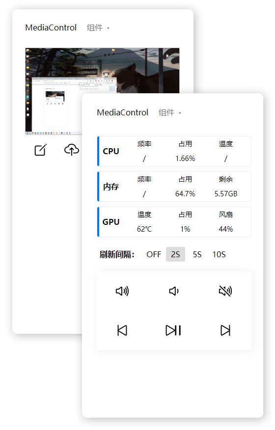

# INORI

集 Windows对媒体控制，基本硬件监控，设备之间剪切板，截图功能于一体的花里胡哨工具

## 说明

项目基于原生 Servlet，需要 Tomcat

#### 多媒体控制

- [x] 音量➕  音量 ➖ （步进 2）  静音
- [x] 上一首  下一首  暂停

#### 硬件监控

- CPU
  - [ ] 频率：Windows 下获取不了睿频频率，鸽了
  - [x] 占用
  - [ ] 温度：获取不了，鸽了
- 内存
  - [ ] 频率：频率本身没啥意义，鸽了
  - [x] 占用
  - [x] 剩余
- GPU [仅英伟达显卡] 官方提供接口
  - [x] 温度
  - [x] 占用
  - [x] 风扇速度百分比

#### 其他

- [x] 各端剪切板共享
- [x] 获取服务的屏幕截图

## 更新历史

- v1.0.0 20220519 发布第一版

